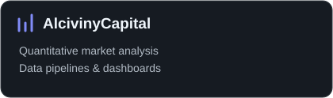

# Vinicius, o Alciviny👋

 Tenho gasto meu tempo com coisas que ninguém vai ver. Por favor, verifique a aba de pensamentos; deve estar em algum lugar perto dos protótipos de drone com armamento laser, testados com Python e cálculos de vetores em R.

**Stack:** Python · TypeScript · Go · PostgreSQL · Docker

[LinkedIn](https://www.linkedin.com/in/alcionis-vinicius) · [Email](mailto:alcionisviniciusdossantossilva@gmail.com)

### Projects

### Contributions

<picture>
  <source media="(prefers-color-scheme: dark)" srcset="https://raw.githubusercontent.com/alciviny/alciviny/output/github-contribution-grid-snake-dark.svg">
  
</picture>
